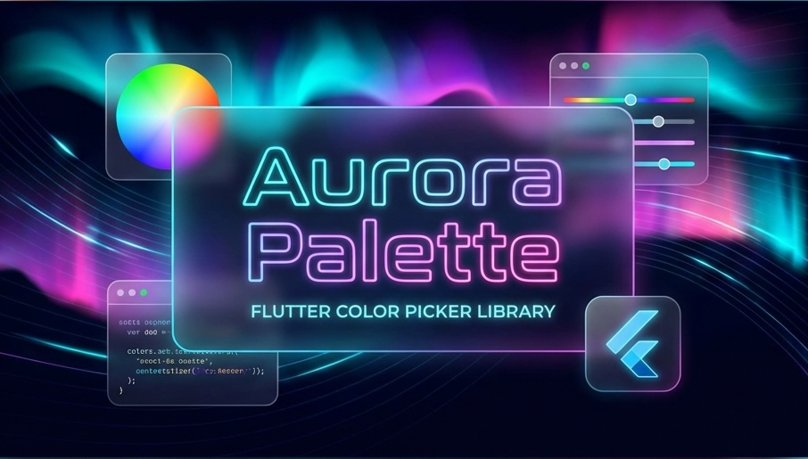

# Aurora Palette 🌈

<p align="center">
  
</p>

A stunning Flutter color picker library with **aurora-inspired animations**, **intelligent color harmonies**, and **premium glassmorphism aesthetics**.

[](https://pub.dev/packages/aurora_palette)
[](https://opensource.org/licenses/MIT)

## ✨ Features

- 🌌 **Aurora Glow Design** - Hand-crafted glassmorphism with neon glow effects
- 🎨 **HSV Color Model** - Intuitive saturation/value area and hue slider
- 🎭 **Color Harmonies** - Complementary, Triadic, Analogous, Tetradic, Split-Complementary, Monochromatic
- 🌡️ **Color Temperature** - Warm/Cool detection and intelligent color naming
- 🔢 **Multiple Input Modes** - Hex, RGB, and visual selectors
- 🌗 **Alpha/Opacity Support** - Checkered background alpha slider
- ⏱️ **Recent Colors History** - Animated color history bar
- ⌨️ **Keyboard Navigation** - Arrow keys for fine-tuning colors
- ♿ **Accessibility** - Full Semantics and screen reader support
- 📱 **Responsive & Adaptive** - Auto-adjusts for mobile and desktop layouts
- 🖥️ **Cross-Platform** - Android, iOS, Web, macOS, Windows, Linux

## 🎯 Unique Features

### Color Harmony Wheel
Generate beautiful color palettes with the aurora-animated harmony wheel:
- **Complementary** - Opposite colors on the wheel
- **Analogous** - Adjacent colors for subtle variations
- **Triadic** - Three evenly-spaced colors
- **Split-Complementary** - Split the complement for more options
- **Tetradic** - Four colors forming a rectangle
- **Monochromatic** - Same hue with varying saturation/brightness

### Color Intelligence
- **Temperature Detection** - Know if your color is warm or cool
- **Brightness Analysis** - Very Light, Light, Medium, Dark, Very Dark
- **Color Naming** - Approximate color names (Red, Orange, Teal, etc.)
- **Contrast Suggestions** - Get the best text color for any background

## 📺 Demo

<p align="center">
  
</p>

## 📦 Installation

Add to your `pubspec.yaml`:

```yaml
dependencies:
  aurora_palette: ^1.0.0
```

## 🚀 Quick Start

```dart
import 'package:flutter/material.dart';
import 'package:aurora_palette/aurora_palette.dart';

class MyColorPickerPage extends StatefulWidget {
  @override
  State<MyColorPickerPage> createState() => _MyColorPickerPageState();
}

class _MyColorPickerPageState extends State<MyColorPickerPage> {
  final _controller = CosmicColorController(initialColor: Colors.cyan);

  @override
  Widget build(BuildContext context) {
    return Scaffold(
      backgroundColor: CosmicDesign.background,
      body: Center(
        child: CosmicColorPicker(
          controller: _controller,
          showAlpha: true,
          showHex: true,
          showRgb: true,
          showRecentColors: true,
          onColorConfirmed: () {
            print('Selected: ${_controller.hexCode}');
          },
        ),
      ),
    );
  }
}
```

## 🎭 Using Color Harmonies

```dart
// Get complementary color
final complement = ColorHarmony.complementary(myColor);

// Get triadic palette (3 colors)
final triadic = ColorHarmony.triadic(myColor);

// Get analogous colors
final analogous = ColorHarmony.analogous(myColor, angle: 30);

// Display the Aurora Harmony Wheel
AuroraHarmonyWheel(
  baseColor: myColor,
  harmonyType: ColorHarmonyType.triadic,
  onColorSelected: (color) => print('Selected: $color'),
)
```

## 🌡️ Using Color Temperature

```dart
// Check if warm or cool
bool isWarm = ColorTemperature.isWarm(myColor);  // true for reds, oranges
bool isCool = ColorTemperature.isCool(myColor);  // true for blues, greens

// Get color name
String name = ColorTemperature.getColorName(myColor);  // "Cyan", "Purple", etc.

// Get contrasting text color
Color textColor = ColorTemperature.getContrastingTextColor(bgColor);

// Get brightness label
String brightness = ColorTemperature.getBrightnessLabel(myColor);  // "Light", "Dark", etc.
```

## 🎛️ Widgets

### `CosmicColorPicker`
The main full-featured color picker widget.

```dart
CosmicColorPicker(
  controller: controller,
  showHex: true,
  showRgb: false,
  showAlpha: true,
  showRecentColors: true,
  enableHaptics: true,
  onColorConfirmed: () {},
)
```

### `AuroraHarmonyWheel`
Animated color harmony visualization.

```dart
AuroraHarmonyWheel(
  baseColor: Colors.blue,
  harmonyType: ColorHarmonyType.triadic,
  size: 200,
  onColorSelected: (color) {},
)
```

### `ColorInfoCard`
Detailed color information display.

```dart
ColorInfoCard(
  color: myColor,
  onCopyHex: () => print('Copied!'),
)
```

## ⌨️ Keyboard Shortcuts

| Key | Action |
|-----|--------|
| ← / → | Adjust Saturation |
| ↑ / ↓ | Adjust Value/Brightness |
| [ / ] | Adjust Hue |
| Enter | Confirm Color Selection |

## 🎨 Design Tokens

Customize the design using `CosmicDesign`:

```dart
CosmicDesign.background    // Dark background color
CosmicDesign.neonCyan      // Accent color
CosmicDesign.neonPurple    // Accent color
CosmicDesign.neonPink      // Accent color
CosmicDesign.neonGlow(color) // Generate glow shadows
```

## ☕ Support

If you love this library, please consider buying me a coffee!

<a href="https://buymeacoffee.com/sitharaj88" target="_blank"></a>

## 📄 License

MIT License - see [LICENSE](LICENSE) for details.

## 🤝 Contributing

Contributions are welcome! Please feel free to submit a Pull Request.

---

Built with 💜 by [Sitharaj](https://github.com/sitharaj)
